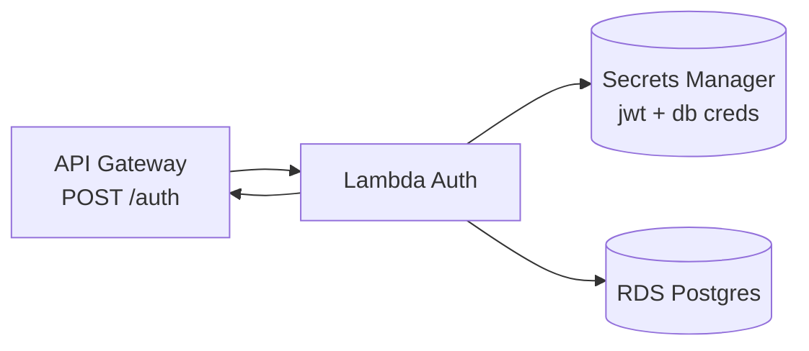

# fiap-fase3-auth-lambda

> Parte do Tech Challenge FIAP — Pós-graduação Software Architecture (14SOAT) — **Fase 3**.

## Propósito

Function Serverless (AWS Lambda) responsável pela autenticação de clientes da oficina via **CPF**. Recebe o CPF, valida (algoritmo de dígitos verificadores), consulta a tabela `customers` no RDS Postgres, e retorna um **JWT** assinado válido por 1 hora.

Invocada via **AWS API Gateway HTTP API** na rota `POST /auth`. Decisão arquitetural em [RFC-02](https://github.com/arthurfcs98/fiap-fase3-app/blob/main/docs/rfcs/RFC-02-auth-cpf-serverless.md) (repo principal).

## Arquitetura



## Tecnologias

| Categoria | Stack |
|-----------|-------|
| Runtime | Node.js 20 |
| Linguagem | TypeScript |
| Bundler | esbuild |
| Libs | `pg`, `jsonwebtoken`, `@aws-sdk/client-secrets-manager`, `pino` |
| Testes | Jest |
| Deploy | Terraform |
| CI/CD | GitHub Actions |

## API

### Request

```http
POST /auth
Content-Type: application/json

{ "cpf": "12345678909" }
```

### Response 200

```json
{
  "token": "eyJ...",
  "expiresIn": 3600,
  "customer": { "id": "uuid", "name": "Arthur" }
}
```

### Erros

| Status | Code | Causa |
|--------|------|-------|
| 400 | A0001 | CPF inválido |
| 404 | A0002 | Cliente não cadastrado |
| 500 | X0001 | Erro interno |

## Setup local

> ⚠️ Em construção. Ver [plano 07](../plans/fase-3/07-lambda-auth.md).

```bash
npm ci
npm test
npm run build           # esbuild → dist/handler.js
```

## Deploy

Pipeline CI/CD em `.github/workflows/deploy.yml`:
1. Build TypeScript com esbuild
2. `terraform init && terraform apply` no diretório `terraform/`

## Repositórios da Fase 3

- [`fiap-fase3-app`](https://github.com/arthurfcs98/fiap-fase3-app) — API principal (docs centrais)
- [`fiap-fase3-auth-lambda`](https://github.com/arthurfcs98/fiap-fase3-auth-lambda) ← você está aqui
- [`fiap-fase3-infra-k8s`](https://github.com/arthurfcs98/fiap-fase3-infra-k8s) — EKS Terraform
- [`fiap-fase3-infra-db`](https://github.com/arthurfcs98/fiap-fase3-infra-db) — RDS Terraform

## Autor

Arthur Freitas Cesarino dos Santos — RM369347
