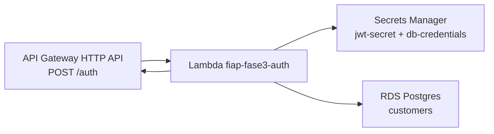

# fiap-fase3-auth-lambda

> **Tech Challenge FIAP — Pós-graduação Software Architecture (14SOAT) — Fase 3**

Function Serverless (AWS Lambda) responsável pela autenticação de clientes via **CPF**. Recebe o CPF, valida (algoritmo brasileiro), consulta `customers` no RDS Postgres, e retorna um JWT HS256 válido por 1 hora.

[](https://github.com/arthurfcs98/fiap-fase3-auth-lambda/actions/workflows/ci.yml)
[](https://github.com/arthurfcs98/fiap-fase3-auth-lambda/actions/workflows/deploy.yml)

## Invocação

```bash
curl -X POST https://aopti5ygbj.execute-api.us-east-1.amazonaws.com/prod/auth \
  -H 'content-type: application/json' \
  -d '{"cpf":"11144477735"}'

# Response 200:
# { "token": "eyJhbGciOi...", "expiresIn": 3600, "customer": { "id": "uuid", "name": "..." } }
```

## Arquitetura



## Stack

| Categoria | Tech |
|-----------|------|
| Runtime | AWS Lambda Node.js 20 |
| Linguagem | TypeScript |
| Bundler | esbuild (CJS, minified, ~200KB) |
| DB driver | `pg` (com pool reaproveitado entre invocações) |
| JWT | `jsonwebtoken` (HS256, exp 1h) |
| Secrets | `@aws-sdk/client-secrets-manager` (cache em variável de módulo) |
| Logs | `pino` JSON |
| Testes | Jest + ts-jest (20 testes, coverage ≥ 80%) |
| Deploy | Terraform |
| CI/CD | GitHub Actions |

## Contratos

### Request

```http
POST /auth
content-type: application/json
x-correlation-id: <opcional>

{ "cpf": "12345678909" }
```

### Responses

| Status | Code | Significado |
|--------|------|-------------|
| 200 | — | Sucesso, retorna `{ token, expiresIn, customer }` |
| 400 | A0001 | CPF inválido (formato ou dígitos verificadores) |
| 404 | A0002 | CPF válido mas cliente não cadastrado |
| 500 | X0001 | Erro interno (SM, RDS, etc.) |

Todo response inclui `x-correlation-id` (gera UUID se ausente no request). Esse mesmo ID propaga nos logs do Lambda Auth, Authorizer e API NestJS.

### Payload do JWT

```json
{
  "sub": "<customerId UUID>",
  "name": "...",
  "cpf": "123*****909",
  "iat": 1748160000,
  "exp": 1748163600
}
```

CPF é mascarado nos claims (LGPD/auditoria).

## Estrutura

```
fiap-fase3-auth-lambda/
├── src/
│   ├── handler.ts            # entrypoint Lambda + factory pra testes
│   ├── cpf-validator.ts      # algoritmo mod 11 + máscara
│   ├── customer-repo.ts      # pg.Pool, SSL on, find by document=cpf AND document_type='CPF'
│   ├── secrets-loader.ts     # AWS SM v3 SDK
│   ├── jwt-issuer.ts         # HS256
│   ├── logger.ts             # pino JSON
│   └── errors.ts             # códigos A0001/A0002/X0001
├── test/                     # 20 testes Jest
├── terraform/                # Lambda + SG + log group, backend S3
└── .github/workflows/
    ├── ci.yml                # lint + test + build + tf validate
    └── deploy.yml            # build + terraform apply (main/homolog)
```

## Restrições do AWS Academy aplicadas

- Execution role: `LabRole` (pré-criada, sem prefixo)
- Lambda em VPC (pra acessar RDS privado) → exige **VPC Endpoint** pra Secrets Manager (criado no `infra-k8s`)
- RDS exige SSL → `pg.Pool` configurado com `ssl: { rejectUnauthorized: false }`
- Sessão STS rota a cada 4h → CI/CD precisa de sync manual (`scripts/sync-aws-creds.sh` no repo `fiap-fase3-app`)

## Setup local + testes

```bash
git clone https://github.com/arthurfcs98/fiap-fase3-auth-lambda
cd fiap-fase3-auth-lambda
npm ci

npm test               # 20 testes
npm run build          # esbuild → dist/handler.js
npm run lint
```

## Deploy

CI/CD em `.github/workflows/deploy.yml`:
1. Build TypeScript → `dist/handler.js` (esbuild bundle)
2. `terraform init` + `terraform apply -auto-approve`
3. Lambda atualizada (mesma execution role, mesma VPC config)

## Repositórios da Fase 3

- [fiap-fase3-app](https://github.com/arthurfcs98/fiap-fase3-app) — API NestJS principal (docs centrais)
- **[fiap-fase3-auth-lambda](https://github.com/arthurfcs98/fiap-fase3-auth-lambda)** (este)
- [fiap-fase3-infra-k8s](https://github.com/arthurfcs98/fiap-fase3-infra-k8s)
- [fiap-fase3-infra-db](https://github.com/arthurfcs98/fiap-fase3-infra-db)

## Autor

Arthur Freitas Cesarino dos Santos — RM369347
